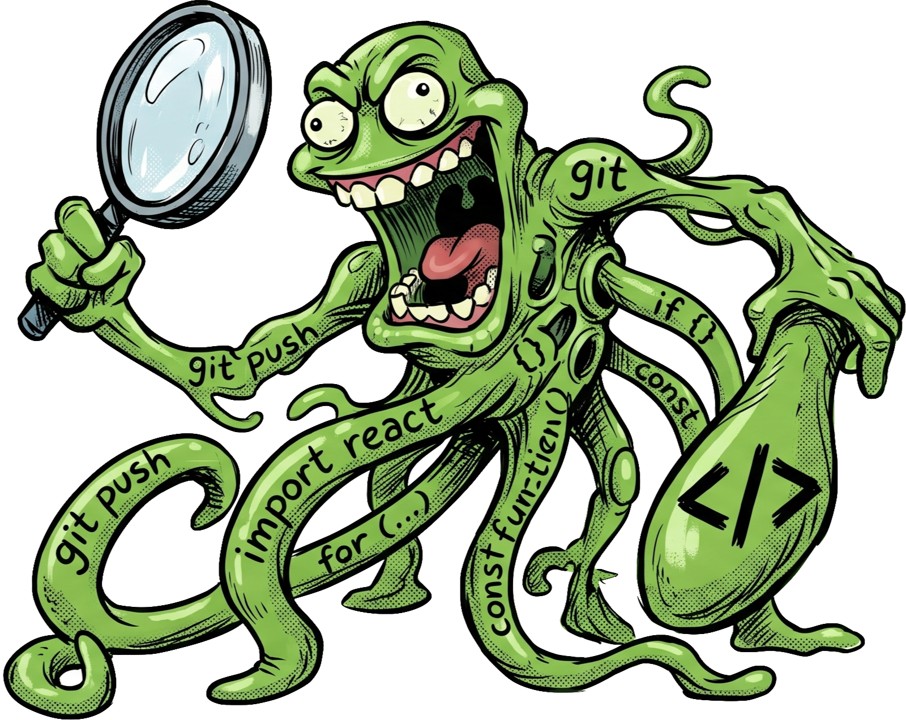
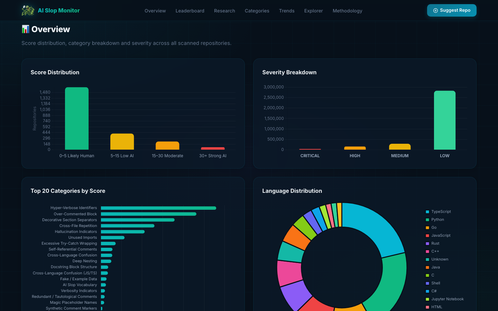
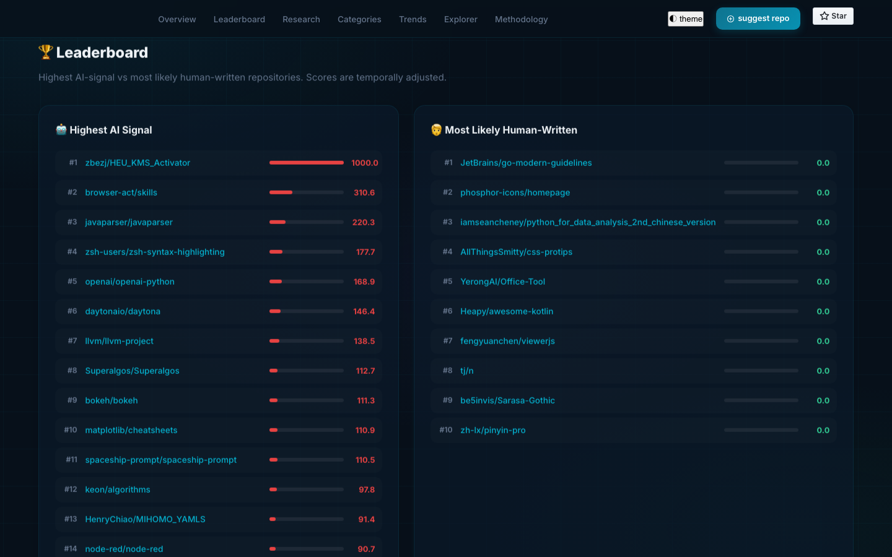
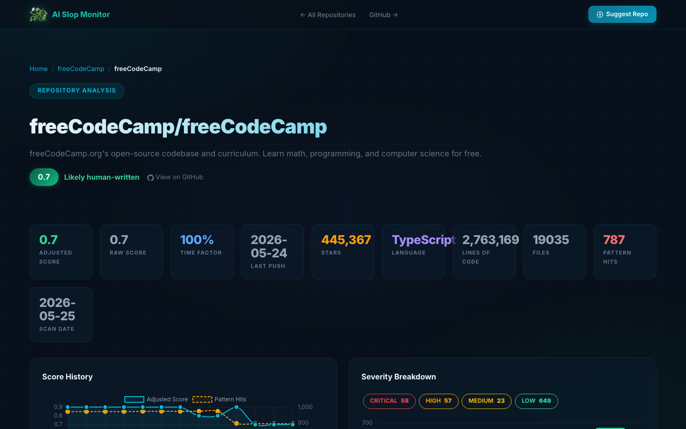

<p align="center">
  
</p>

<h1 align="center">AI Code Slop Monitor</h1>

<p align="center">
  <strong>Real-time detection of AI-generated code across open-source repositories</strong><br>
  <em>Powered by <a href="https://github.com/marcoramilli/SynthScan">SynthScan</a> — the synthetic code fingerprint engine</em>
</p>

<p align="center">
  <a href="https://slopcodemonitor.ai"></a>
  
  
</p>

---

## 🔍 What Is This?

**AI Code Slop Monitor** automatically scans hundreds of trending GitHub repositories looking for telltale signs of AI-generated ("slop") code — repetitive patterns, excessive boilerplate, decorative separators, over-commented logic, and more.

Every day, the scanner:
1. Fetches the most popular repositories from GitHub's trending feed
2. Clones each repo and runs **SynthScan** pattern analysis
3. Computes a **Synth Score** (0–10) for each repository
4. Publishes this interactive dashboard with full drill-down details

> **Why does this matter?** As AI-assisted coding becomes ubiquitous, understanding how much code is machine-generated — and where quality suffers — is critical for maintainers, reviewers, and the open-source community.

---

## 📊 Dashboard Preview

<p align="center">
  <br>
  <em>KPI cards, score distribution, and category breakdown at a glance</em>
</p>

<p align="center">
  <br>
  <em>Sortable table with scores, deltas, and drill-down links for every repository</em>
</p>

<p align="center">
  <br>
  <em>Per-repository findings with file-level detail and severity indicators</em>
</p>

---

## 🏗️ How It Works

```
┌─────────────────────┐     ┌───────────────┐     ┌──────────────────────┐
│  fetch_trending.py   │────▶│   repos.txt   │────▶│   slop_monitor.py    │
│  GitHub Search API   │     │  700+ repos   │     │  Clone → Scan →      │
│  daily auto-update   │     └───────────────┘     │  Score → Report      │
└─────────────────────┘                            └──────────┬───────────┘
                                                              │
                                         ┌────────────────────┼──────────────┐
                                         ▼                    ▼              ▼
                                   index.html          reports/         images/
                                                    detail_*.html    logo + shots
```

| Component | Purpose |
|---|---|
| **SynthScan** | Pattern engine — matches 50+ synthetic code fingerprints with severity scoring |
| **slop_monitor.py** | Orchestrator — parallel cloning, scanning, aggregation, and HTML generation |
| **fetch_trending.py** | Feeder — discovers trending repos via GitHub Search API |
| **deploy.sh** | Publisher — structures and pushes the site to GitHub Pages |

---

## 📈 Scoring Model

Each repository receives a **Synth Score** from 0 to 10:

| Score | Label | Meaning |
|:---:|---|---|
| **8.0 – 10.0** | 🔴 Critical | Strong AI-generation fingerprint |
| **5.0 – 7.9** | 🟠 High | Significant synthetic patterns detected |
| **2.0 – 4.9** | 🟡 Medium | Some AI-style patterns present |
| **0.0 – 1.9** | 🟢 Low | Likely human-written |

Scores are normalized by lines of code, so large codebases aren't unfairly penalised.

---

## 🚀 Live Dashboard

👉 **[Visit slopcodemonitor.ai →](https://slopcodemonitor.ai)**

The dashboard is rebuilt daily and features:
- **Dark emerald glass UI** with smooth gradients
- **Interactive Chart.js charts** — histograms, category breakdowns, top-30 rankings
- **Sortable table** with score deltas (↑↓) from the previous scan
- **SLOP Alert badges** on repos with score ≥ 7.5
- **Detail drill-down** for every repository — see every finding, file, and line number

---

## 🤝 Suggest a Repository

Think a repo should be scanned? Open an issue:

<p align="center">
  <a href="https://github.com/marcoramilli/slopcodemonitor.ai/issues/new?title=%5BRepo+Suggestion%5D+&labels=repo-suggestion&body=%23%23+Repository+Suggestion%0A%0A**Repository+URL**%3A+%0A%3E+Paste+the+full+GitHub+URL+here+%28e.g.+https%3A%2F%2Fgithub.com%2Fowner%2Frepo%29%0A%0A**Why+should+we+scan+this+repo%3F**%0A%0A-+%5B+%5D+Popular+%2F+widely+used+project%0A-+%5B+%5D+Suspected+AI-generated+code%0A-+%5B+%5D+Educational+%2F+research+interest%0A-+%5B+%5D+Other%0A%0A**Additional+context+%28optional%29**%3A%0A"></a>
</p>

---

## 🔗 Related Projects

| Project | Description |
|---|---|
| [**SynthScan**](https://github.com/marcoramilli/SynthScan) | The pattern-matching engine that powers this monitor |
| [**SLOP-Code-Calculator**](https://github.com/marcoramilli/SLOP-Code-Calculator) | Source code for the scanner, fetcher, and report generator |

---

<p align="center">
  <br>
  <sub>Built by <a href="https://github.com/marcoramilli">Marco Ramilli</a> · Updated daily · Powered by SynthScan</sub>
</p>
